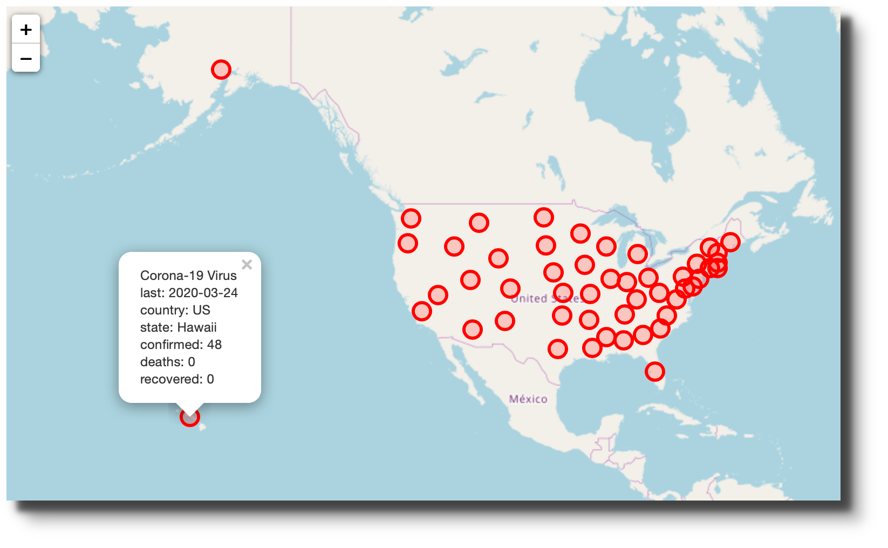

# Covid-19 Data Project

Repository relies upon the data maintained by Johns Hopkins at this [repository](https://github.com/CSSEGISandData/COVID-19). The scripts combine the separately reported confirmations, deaths and recoveries into one file.  Also, the data are converted from wide to long.

## Order of execution

To run, `source("./000_main_script.R")`.
```
## Scripts run in numerical order
.
├── 000_main_script.R
├── 010_download_confirmed_case_data.R
├── 011_download_death_data.R
├── 012_download_recovered_data.R
├── 020_filter_to_confirmed_us_cases.R
├── 021_filter_to_deaths_us_cases.R
├── 022_filter_to_recovered_us_cases.R
├── 030_combine_tidy_data_sets.R
├── 040_add_variables_for_final_data_frame.R
├── 050_convert_csv_to_json.R
├── 060_build_confirm_case_growth.R
```

## Built with R, Plotly & Leaflet

The data was the foundation for two blog posts: The first [one](https://www.robwiederstein.org/blog/2020/3/14/us-corona-virus-cases) dealt with the distribution of cases by state in the United States. The map was built in jquery using [Leaflet](https://leafletjs.com).

The second [post](https://www.robwiederstein.org/blog/2020/3/20/kentucky-covid-19-cases) showed the growth in Covid-19 confirmations in Kentucky and some contiguous states. The chart was generated in [Plotly](https://plotly.com).

## Installation

Plotly requires registration and an API key. 

<!-- LICENSE -->
## License

Distributed under the MIT License. See [`LICENSE`](LICENSE.md) for more information.


## Contact

Rob Wiederstein [@RobWiederstein](https://twitter.com/RobWiederstein) - khuon68@gmail.com

Project Link: [https://github.com/Rob/covid-19-ky](https://github.com/RobWiederstein/covid-19-ky)


<!-- ACKNOWLEDGEMENTS -->
## Acknowledgements
* [New York Times](https://www.nytimes.com) for their free Covid-19 coverage and data-driven stories.
* [Washington Post](https://www.washingtonpost.com) for their equally rigorous data reporting and data animations.
